```mermaid
flowchart TD
    START([🔴 MFP Scan Fails]) --> Q1{Can MFP reach<br/>server by hostname?}
    Q1 -- No --> FIX1[Check DNS resolution<br/>Verify server is online<br/>Test: ping server name from MFP admin page]
    Q1 -- Yes --> Q2{Is Xerox Connect<br/>App Service running?}
    Q2 -- No --> FIX2[Start service on Windows Server<br/>sc start XeroxConnectApp<br/>Check Event Viewer for crash cause]
    Q2 -- Yes --> Q3{Is M-Files Server<br/>accepting connections?}
    Q3 -- No --> FIX3[Restart M-Files Server service<br/>Check port 2266 is open<br/>Review vault status in M-Files Admin]
    Q3 -- Yes --> Q4{Are MFP credentials<br/>valid in M-Files?}
    Q4 -- No --> FIX4[Reset service account password<br/>Update credential in ConnectKey Workflow config<br/>Re-test scan workflow]
    Q4 -- Yes --> Q5{Is SSL cert<br/>valid / not expired?}
    Q5 -- No --> FIX5[Renew SSL cert on M-Files Server<br/>Re-export and re-import to MFP trust store]
    Q5 -- Yes --> FIX6[Collect full diagnostic logs<br/>Escalate to Tier 2 / Xerox Support]
```

# Solutions Integration Runbook
## Xerox — Accounts Payable & ECM Integration
### Montréal Remote Mandate · Contract Role · February 2026

> **Prepared by:** Harry Joseph  
> **Title:** Application Developer Lead — Solutions Integration Engineer  
> **Date:** February 24, 2026  
> **Role Reference:** XNAJP00028075  
> **Website:** [scriptdotnet.com](https://scriptdotnet.com) — Consulting: Cloud, Automation & Workflow, Application Support, SQL / ASP.NET  
> **Scope:** M-Files ECM · Xerox ConnectKey MFP · SQL Server · Accounts Payable Automation · Windows Server  
> **Audience:** Business Stakeholders & Management  
> **Classification:** Internal — Technical Reference  
> **Languages:** Bilingual — English / Français *(full documentation available in both languages upon request — disponible en français sur demande)*

**Document Map:** Operational procedures and troubleshooting are in this runbook; technical validation scoring checklists and sign-off templates are in [toolsheet.md](toolsheet.md).

---

## Table of Contents

0. [How to Use This Runbook](#0-how-to-use-this-runbook)
    - [Technical Validation Toolsheet](toolsheet.md)
1. [Executive Summary](#1-executive-summary)
2. [Solution Architecture Overview](#2-solution-architecture-overview)
3. [How M-Files Interacts with the Business](#3-how-m-files-interacts-with-the-business)
4. [Accounts Payable End-to-End Workflow](#4-accounts-payable-end-to-end-workflow)
5. [Scenario 1 — Invoice Capture via Xerox MFP Fails](#5-scenario-1--invoice-capture-via-xerox-mfp-fails)
6. [Scenario 2 — M-Files Workflow Approval Is Stuck](#6-scenario-2--m-files-workflow-approval-is-stuck)
7. [Scenario 3 — SQL / ODBC Connectivity Failure](#7-scenario-3--sql--odbc-connectivity-failure)
8. [Scenario 4 — M-Files Vault Unreachable / Login Failure](#8-scenario-4--m-files-vault-unreachable--login-failure)
9. [Scenario 5 — OCR / Data Extraction Produces Wrong Results](#9-scenario-5--ocr--data-extraction-produces-wrong-results)
10. [Automation Toolkit — PowerShell & VBScript](#10-automation-toolkit--powershell--vbscript)
    - [10.1 Daily Health Report](#101--daily-m-files--ap-health-report)
    - [10.2 New User Provisioning](#102--new-user-provisioning-in-m-files-via-api)
    - [10.3 Vault Backup Verification](#103--automated-vault-backup-verification)
    - [10.4 VBScript — M-Files Event Handler](#104--vbscript--m-files-event-handler)
11. [Active Directory & M365 Security](#11-active-directory--m365-security)
12. [Escalation & Resolution Matrix](#12-escalation--resolution-matrix)
13. [Key Performance Indicators (KPIs)](#13-key-performance-indicators-kpis)
14. [Revision Notes](#14-revision-notes)

---

## 0. How to Use This Runbook

Use this section first before executing any scenario.

For technical validation scoring, bilingual triage checklists, and printable sign-off templates, use the standalone toolsheet:

➡️ [Technical Validation Toolsheet](toolsheet.md)

### Operating Environment

| Item | Requirement |
|---|---|
| Core stack | Windows Server + M-Files Server + Xerox Capture Agent + SQL Server |
| Supporting services | Active Directory, Microsoft 365 (M365) relay/notifications, OCR engine, ODBC/ERP connectivity |
| Operator profile | IT Admin / Solutions Engineer with runbook access |
| Required access | Local admin on integration servers, M-Files Admin rights, SQL read/diagnostic access, AD read access |
| Safety mode | Run all scripts in **DEV/UAT first**, then promote to PROD after validation |

### Inputs, Outputs, and Success Criteria

| Item | Definition |
|---|---|
| Expected input | Incident symptom (error message, affected system, timestamp, impacted users) |
| Expected output | Confirmed root cause, documented fix steps, and validated recovery evidence |
| Completion criteria | Service restored + test transaction completed + incident notes updated |

### Estimated Time by Section

| Section / Scenario | Typical Duration |
|---|---|
| Initial triage and scope confirmation | 10–15 min |
| Scenario 1 — MFP capture failure | 30–60 min |
| Scenario 2 — workflow stuck | 30–90 min |
| Scenario 3 — SQL/ODBC failure | 20–60 min |
| Scenario 4 — vault unreachable/login failure | 15–45 min |
| Scenario 5 — OCR extraction issue | 45–120 min |
| Post-incident validation and handoff notes | 10–20 min |

### Quick Validation Examples (Command + Expected Output)

```powershell
# Service state check
Get-Service "MFiles Server"
# Expected: Status = Running

# SQL port reachability check
Test-NetConnection -ComputerName SQLSVR -Port 1433
# Expected: TcpTestSucceeded : True

# M-Files server port check
Test-NetConnection -ComputerName MFILESSVR -Port 2266
# Expected: TcpTestSucceeded : True
```

```sql
-- Validation query (post-approval sync check)
SELECT TOP 10 InvoiceNumber, Status, LastUpdated
FROM dbo.InvoiceQueue
ORDER BY LastUpdated DESC;
-- Expected: recently approved invoices appear with updated status/time.
```

---

## 1. Executive Summary

This runbook defines the operational procedures, integration architecture, troubleshooting scenarios, and automation strategies for implementing and supporting a **Xerox Accounts Payable (AP) and Enterprise Content Management (ECM)** solution centered on **M-Files** in a Windows Server environment.

The solution delivers:

| Capability | Business Value |
|---|---|
| Automated invoice capture via Xerox MFP | Eliminates manual data entry — reduces processing time by up to 70% |
| M-Files intelligent document management | Single source of truth for all AP documents across departments |
| SQL-backed reporting | Real-time visibility into invoice status, approval bottlenecks, and spend |
| PowerShell automation | Consistent, auditable configuration — zero-touch deployment repeatability |
| Workflow-driven AP approvals | Enforces policy, provides audit trail, reduces duplicate payments |

---

## 2. Solution Architecture Overview


---

## 3. How M-Files Interacts with the Business

M-Files is not just a file repository — it is an **active participant in business process automation**. The diagram below shows how each department interacts with M-Files in daily operations.


### M-Files Value Touchpoints by Role

| Role | Daily Interaction | M-Files Feature Used |
|---|---|---|
| AP Clerk | Upload invoices, tag to vendor | Capture + Auto-metadata |
| AP Manager | Approve invoices in workflow | Workflow State Transitions |
| Finance Director | Review spend dashboards | SQL reporting via ODBC |
| IT Admin | Health monitoring, user management | Admin Console + PowerShell API |
| External Auditor | Read-only access to closed AP items | Retained Views + Audit Log |

---

## 4. Accounts Payable End-to-End Workflow

```mermaid
flowchart TD
    A([📄 Invoice Received]) --> B{Source?}
    B -- "📠 Paper/Fax" --> C[Scanned via Xerox MFP<br/>ConnectKey Workflow App]
    B -- "📧 Email" --> D[Email Capture Rule<br/>Exchange → M-Files]
    B -- "🌐 Vendor Portal" --> E[API / EDI Upload]

    C --> F[OCR Engine Extracts:<br/>Vendor · Amount · PO# · Date]
    D --> F
    E --> F

    F --> G{PO Match?}
    G -- "✅ Match Found" --> H[Auto-populate Metadata<br/>Link to Purchase Order]
    G -- "❌ No Match" --> I[Flag for Manual Review<br/>Assign to AP Clerk]

    H --> J[M-Files Workflow:<br/>STATE — Pending Approval]
    I --> J

    J --> K{Amount Threshold?}
    K -- "< $5,000" --> L[AP Manager Approval]
    K -- "$5,000 – $25,000" --> M[Department Director Approval]
    K -- "> $25,000" --> N[CFO / Finance Approval]

    L --> O{Decision}
    M --> O
    N --> O

    O -- "✅ Approved" --> P[M-Files Workflow:<br/>STATE — Approved]
    O -- "❌ Rejected" --> Q[Notification to AP Clerk<br/>Rejection Reason Logged]
    O -- "⏸️ Hold / More Info" --> R[Workflow STATE — On Hold<br/>Query Sent to Vendor]

    P --> S[ERP Entry Triggered<br/>via ODBC / SQL]
    S --> T[Payment Scheduled<br/>in Accounting System]
    T --> U[M-Files Workflow:<br/>STATE — Paid & Archived]

    Q --> A
    R --> J
    U --> V([✅ Process Complete — Audit Trail Retained])
```



---

## 5. Scenario 1 — Invoice Capture via Xerox MFP Fails

### Business Impact
AP Clerks cannot scan invoices from the Xerox device. Documents pile up physically. AP processing halts.

### Symptoms
- Scan-to-Workflow app on the MFP panel shows an error or spins indefinitely
- No documents appear in the M-Files vault or capture queue
- Xerox Connect App agent log shows connection refused

### Root Cause Decision Tree



### Step-by-Step Resolution

| Step | Action | Command / Tool |
|---|---|---|
| 1 | Verify Xerox Connect App service status | `Get-Service XeroxConnectApp` (PowerShell) |
| 2 | Restart service if stopped | `Restart-Service XeroxConnectApp -Force` |
| 3 | Check M-Files Server port reachability | `Test-NetConnection -ComputerName MFILESSVR -Port 2266` |
| 4 | Review Windows Event Viewer | `eventvwr.msc` → Application & Services → M-Files |
| 5 | Validate service account login in vault | M-Files Admin → Connections → Test Login |
| 6 | Check SSL certificate expiry | `Get-ChildItem Cert:\LocalMachine\My` |
| 7 | Review Xerox ConnectKey workflow config | Xerox App Gallery Admin Portal |
| 8 | Test end-to-end scan after each fix | Scan a single test page and verify in M-Files vault |

### Automation — Health Check Script

```powershell
# ============================================================
# Script   : MFP Capture Health Check
# Scenario : 1 — Invoice Capture via Xerox MFP Fails
# Author   : Harry Joseph — Application Developer Lead
# Language  : PowerShell
# Env      : DEV (test before promoting to PROD)
# Date     : 2026-02-24
# ============================================================
# Run on the Windows Server hosting the Capture Agent

$services = @("XeroxConnectApp", "MFiles Server")
foreach ($svc in $services) {
    $s = Get-Service -Name $svc -ErrorAction SilentlyContinue
    if ($s.Status -ne "Running") {
        Write-Warning "Service '$svc' is NOT running. Attempting restart..."
        Start-Service -Name $svc
        Start-Sleep -Seconds 5
        $s.Refresh()
        if ($s.Status -eq "Running") {
            Write-Host "[OK] '$svc' restarted successfully." -ForegroundColor Green
        } else {
            Write-Error "[FAIL] '$svc' failed to start. Manual intervention required."
        }
    } else {
        Write-Host "[OK] '$svc' is running." -ForegroundColor Green
    }
}

# Test M-Files port connectivity
$portTest = Test-NetConnection -ComputerName "MFILESSVR" -Port 2266 -WarningAction SilentlyContinue
if ($portTest.TcpTestSucceeded) {
    Write-Host "[OK] M-Files port 2266 is reachable." -ForegroundColor Green
} else {
    Write-Warning "[WARN] M-Files port 2266 is NOT reachable from this server."
}

# SSL Certificate expiry check
$threshold = (Get-Date).AddDays(30)
Get-ChildItem Cert:\LocalMachine\My | Where-Object { $_.NotAfter -lt $threshold } | ForEach-Object {
    Write-Warning "[WARN] Certificate '$($_.Subject)' expires on $($_.NotAfter) — RENEW SOON"
}
```

---

## 6. Scenario 2 — M-Files Workflow Approval Is Stuck

### Business Impact
Invoices sit in "Pending Approval" state indefinitely. Vendors are not paid on time. Late fees accumulate. Management has no visibility.

### Symptoms
- AP Manager reports not receiving approval notification emails
- Invoice remains in "Pending Approval" state in M-Files past SLA (e.g., 48 hours)
- Workflow history shows the object never transitioned

### Root Cause Decision Tree


### Step-by-Step Resolution

| Step | Action | Tool |
|---|---|---|
| 1 | Open M-Files Admin → Server → Notifications | M-Files Admin Console |
| 2 | Verify SMTP server / Microsoft 365 relay config | M-Files Admin → Notification Rules |
| 3 | Check workflow definition for the stuck state | M-Files Admin → Workflows → Edit |
| 4 | Review workflow history on the stuck object | M-Files Client → right-click object → History |
| 5 | Check VBScript / event handler logs | Windows Event Viewer → Application |
| 6 | Manually advance workflow state for urgent invoices | M-Files Admin → object → Force State Transition |
| 7 | Add escalation rule: auto-escalate after 48 hours | Workflow State → Automatic Transitions → Time-based |
| 8 | Document root cause and update workflow | Internal change log |

### Best Practice — Escalation Workflow Design

```mermaid
stateDiagram-v2
    [*] --> PendingApproval : Invoice Submitted
    PendingApproval --> Approved : Approver Action ✅
    PendingApproval --> Rejected : Approver Action ❌
    PendingApproval --> Escalated : ⏰ 48 hours — No Action
    Escalated --> Approved : Manager Override ✅
    Escalated --> Rejected : Manager Override ❌
    Approved --> PaidArchived : ERP Payment Confirmed
    Rejected --> PendingRevision : Returned to AP Clerk
    PendingRevision --> PendingApproval : Resubmitted
    PaidArchived --> [*]
```



---

## 7. Scenario 3 — SQL / ODBC Connectivity Failure

### Business Impact
M-Files cannot update the ERP system. Financial data is out of sync. Reporting dashboards show stale data. Duplicate payments become a risk.

### Symptoms
- M-Files workflow scripts log "ODBC connection failed" or "SQL Server login failed"
- ERP records not updating after invoice approval
- SQL Reporting Services dashboards show N/A or no data

### Root Cause Decision Tree


### Step-by-Step Resolution

| Step | Action | Command / Tool |
|---|---|---|
| 1 | Confirm SQL Server service is running | `Get-Service MSSQLSERVER` or SSMS |
| 2 | Test SQL port from M-Files server | `Test-NetConnection -ComputerName SQLSVR -Port 1433` |
| 3 | Test ODBC DSN connectivity | ODBC Data Source Admin → Test Connection |
| 4 | Check SQL login status | SSMS → Security → Logins → [service account] |
| 5 | Review SQL Error Log | SSMS → Management → SQL Server Logs |
| 6 | Validate M-Files connection string | M-Files Admin → External DB Connection |
| 7 | Run test query from M-Files | M-Files Admin → Test Query |

### Example Verification Outputs

```powershell
PS> Get-Service MSSQLSERVER

Status   Name               DisplayName
------   ----               -----------
Running  MSSQLSERVER        SQL Server (MSSQLSERVER)

PS> Test-NetConnection -ComputerName SQLSVR -Port 1433

ComputerName     : SQLSVR
RemotePort       : 1433
TcpTestSucceeded : True
```

```sql
SELECT COUNT(*) AS PendingInvoices
FROM dbo.InvoiceQueue
WHERE Status = 'Pending';

-- Expected example output:
-- PendingInvoices
-- ---------------
-- 12
```

### Automation — ODBC & SQL Health Check

```powershell
# ============================================================
# Script   : SQL & ODBC Connectivity Validation
# Scenario : 3 — SQL / ODBC Connectivity Failure
# Author   : Harry Joseph — Application Developer Lead
# Language  : PowerShell
# Env      : DEV (test before promoting to PROD)
# Date     : 2026-02-24
# ============================================================

param(
    [string]$SqlServer  = "SQLSVR",
    [string]$Database   = "AP_Integration",
    [string]$SqlUser    = "mfiles_svc",
    [string]$SqlPass    = $env:MFILES_SQL_PASSWORD   # Store in secure env var
)

# 1. Test TCP connectivity
$conn = Test-NetConnection -ComputerName $SqlServer -Port 1433 -WarningAction SilentlyContinue
if (-not $conn.TcpTestSucceeded) {
    Write-Error "[FAIL] Cannot reach SQL Server '$SqlServer' on port 1433. Check firewall/service."
    exit 1
}
Write-Host "[OK] SQL Server port 1433 reachable." -ForegroundColor Green

# 2. Test SQL login
try {
    $connStr = "Server=$SqlServer;Database=$Database;User Id=$SqlUser;Password=$SqlPass;Connection Timeout=10;"
    $sqlConn = New-Object System.Data.SqlClient.SqlConnection($connStr)
    $sqlConn.Open()
    Write-Host "[OK] SQL login successful for user '$SqlUser'." -ForegroundColor Green

    # 3. Run a basic validation query
    $cmd = $sqlConn.CreateCommand()
    $cmd.CommandText = "SELECT COUNT(*) FROM dbo.InvoiceQueue WHERE Status = 'Pending'"
    $pendingCount = $cmd.ExecuteScalar()
    Write-Host "[INFO] Pending invoices in queue: $pendingCount"
    $sqlConn.Close()
}
catch {
    Write-Error "[FAIL] SQL connection failed: $_"
}

# 4. Check ODBC DSN
$dsnName = "MFiles_AP_DSN"
$odbc = Get-OdbcDsn -Name $dsnName -ErrorAction SilentlyContinue
if ($odbc) {
    Write-Host "[OK] ODBC DSN '$dsnName' found: $($odbc.DsnType)" -ForegroundColor Green
} else {
    Write-Warning "[WARN] ODBC DSN '$dsnName' not found. May need to be created."
}
```

---

## 8. Scenario 4 — M-Files Vault Unreachable / Login Failure

### Business Impact
All M-Files users across AP, Finance, and other departments lose access to documents. Business operations halt. Approvals, lookups, and document retrievals are impossible.

### Symptoms
- M-Files client shows "Cannot connect to server" or "Vault offline"
- Users receive "Access denied" despite correct credentials
- M-Files Admin Console cannot connect to the vault

### Root Cause Decision Tree


### Step-by-Step Resolution

| Step | Action | Tool |
|---|---|---|
| 1 | Check M-Files Server service | `Get-Service "MFiles Server"` |
| 2 | Review vault status | M-Files Admin → Vaults → status column |
| 3 | Check available disk space on vault host | `Get-PSDrive C` — vault requires >10% free |
| 4 | Review M-Files event log | Event Viewer → Applications → M-Files |
| 5 | Check AD sync status | M-Files Admin → Authentication → Active Directory |
| 6 | Verify user account & license | M-Files Admin → Users → [user] → License Type |
| 7 | Test client login with admin credentials | M-Files Desktop client → new connection |
| 8 | Check concurrent user limits | M-Files Admin → License → Named User Count |

---

## 9. Scenario 5 — OCR / Data Extraction Produces Wrong Results

### Business Impact
Incorrect vendor names, amounts, or PO numbers are extracted from invoices. This causes mismatch with ERP, failed PO matching, and potential duplicate or incorrect payments.

### Symptoms
- Invoice metadata in M-Files shows wrong vendor name or amount
- PO matching consistently fails on scanned invoices
- OCR confidence score is below threshold in capture logs

### Root Cause Decision Tree


### Step-by-Step Resolution

| Step | Action | Tool |
|---|---|---|
| 1 | Review scan quality — check resolution | Xerox MFP Admin Page → Scan Settings |
| 2 | Set minimum resolution to 300 DPI | ConnectKey App Studio → Scan Profile |
| 3 | Check OCR engine logs for confidence scores | Capture app log directory on server |
| 4 | Open OCR template editor for affected vendor | Xerox / M-Files Capture Admin |
| 5 | Update extraction zones / field anchors | Capture template editor — re-draw zones |
| 6 | Configure low-confidence threshold routing | Capture rule: if confidence < 75% → manual queue |
| 7 | Process 10 test invoices after change | Verify metadata in M-Files vault after each test |
| 8 | Document vendor template changes | Capture template changelog |

---

## 10. Automation Toolkit — PowerShell & VBScript

These scripts automate routine tasks, reduce manual effort, and ensure consistency across deployments.

### 10.1 — Daily M-Files & AP Health Report

```powershell
<#
.SYNOPSIS
    Daily health check for M-Files Server and AP integration components.
    Run as a Scheduled Task — 07:30 AM weekdays.
.NOTES
    Author   : Harry Joseph — Application Developer Lead
    Language  : PowerShell
    Env      : DEV (test before promoting to PROD)
    Date     : 2026-02-24
.OUTPUTS
    Email report to IT team + management summary
#>

param(
    [string]$MFilesServer  = "MFILESSVR",
    [string]$SqlServer     = "SQLSVR",
    [string]$ReportEmail   = "it-team@company.com",
    [string]$SmtpServer    = "smtp.office365.com"
)

$report = @()
$timestamp = Get-Date -Format "yyyy-MM-dd HH:mm"

# --- M-Files Server Service ---
$mfSvc = Get-Service "MFiles Server" -ComputerName $MFilesServer -ErrorAction SilentlyContinue
$mfStatus = if ($mfSvc.Status -eq "Running") { "[OK] Online" } else { "[FAIL] OFFLINE" }
$report += "M-Files Server Service: $mfStatus"

# --- Xerox Capture Agent ---
$xcaSvc = Get-Service "XeroxConnectApp" -ErrorAction SilentlyContinue
$xcaStatus = if ($xcaSvc.Status -eq "Running") { "[OK] Online" } else { "[FAIL] OFFLINE" }
$report += "Xerox Capture Agent: $xcaStatus"

# --- SQL Connectivity ---
$sqlConn = Test-NetConnection -ComputerName $SqlServer -Port 1433 -WarningAction SilentlyContinue
$sqlStatus = if ($sqlConn.TcpTestSucceeded) { "[OK] Reachable" } else { "[FAIL] UNREACHABLE" }
$report += "SQL Server Connectivity: $sqlStatus"

# --- Disk Space on M-Files Host ---
$disk = Get-PSDrive C -PSProvider FileSystem
$freePercent = [math]::Round(($disk.Free / ($disk.Free + $disk.Used)) * 100, 1)
$diskStatus = if ($freePercent -gt 15) { "[OK] ${freePercent}% free" } else { "[WARN] Low disk: ${freePercent}% free" }
$report += "Disk Space (C:\): $diskStatus"

# --- SSL Certificate Check ---
$certs = Get-ChildItem Cert:\LocalMachine\My | Where-Object { $_.NotAfter -lt (Get-Date).AddDays(30) }
$certStatus = if ($certs) { "[WARN] $($certs.Count) cert(s) expiring within 30 days" } else { "[OK] All certs valid" }
$report += "SSL Certificates: $certStatus"

# --- Build Report ---
$body = "AP Integration Health Report — $timestamp`n"
$body += "=" * 50 + "`n"
$body += ($report -join "`n")
$body += "`n`nGenerated automatically by PowerShell Automation Agent."

Write-Host $body

# Send email
Send-MailMessage -To $ReportEmail -From "automation@company.com" `
    -Subject "AP Integration Health — $timestamp" `
    -Body $body -SmtpServer $SmtpServer -Port 587 -UseSsl `
    -Credential (Get-StoredCredential -Target "SmtpRelay")
```

### 10.2 — New User Provisioning in M-Files via API

```powershell
<#
.SYNOPSIS
    Provision a new AP user in M-Files linked to Active Directory.
    Ensures consistent onboarding: correct group, license, and vault access.
.NOTES
    Author   : Harry Joseph — Application Developer Lead
    Language  : PowerShell
    Env      : DEV (test before promoting to PROD)
    Date     : 2026-02-24
.PARAMETER Username  AD username (SAMAccountName)
.PARAMETER Role      AP_Clerk | AP_Manager | Finance_Director
#>

param(
    [Parameter(Mandatory)][string]$Username,
    [Parameter(Mandatory)][ValidateSet("AP_Clerk","AP_Manager","Finance_Director")][string]$Role
)

# Role → M-Files Group mapping
$roleGroupMap = @{
    "AP_Clerk"          = "AP Clerks"
    "AP_Manager"        = "AP Managers"
    "Finance_Director"  = "Finance Directors"
}

$targetGroup = $roleGroupMap[$Role]
Write-Host "Provisioning user '$Username' as '$Role' → M-Files Group: '$targetGroup'"

# Import M-Files PowerShell module (requires M-Files Tools for PowerShell)
Import-Module MFilesAPI -ErrorAction Stop

$vault = New-MFilesVaultConnection -Server "MFILESSVR" -Vault "AP Vault" `
    -UseCurrentWindowsUser

# Create user
$newUser = New-MFilesUser -VaultConnection $vault `
    -Name $Username `
    -AuthenticationType WindowsAuthentication `
    -LicenseType NamedUser

# Assign to group
Add-MFilesUserToGroup -VaultConnection $vault -Username $Username -GroupName $targetGroup

Write-Host "[OK] User '$Username' provisioned in M-Files with role '$Role'." -ForegroundColor Green
Write-Host "[INFO] Group assigned: $targetGroup"
```

### 10.3 — Automated Vault Backup Verification

```powershell
<#
.SYNOPSIS
    Verifies that the M-Files vault backup completed successfully last night.
    Alerts IT if backup is missing or older than 25 hours.
.NOTES
    Author   : Harry Joseph — Application Developer Lead
    Language  : PowerShell
    Env      : DEV (test before promoting to PROD)
    Date     : 2026-02-24
#>

$backupPath   = "\\BACKUPSVR\MFilesBackups\APVault"
$alertEmail   = "it-team@company.com"
$maxAgeHours  = 25

$latestBackup = Get-ChildItem $backupPath -Filter "*.mfb" |
    Sort-Object LastWriteTime -Descending | Select-Object -First 1

if (-not $latestBackup) {
    $msg = "[FAIL] CRITICAL: No M-Files backup file found in '$backupPath'!"
    Write-Error $msg
} elseif ($latestBackup.LastWriteTime -lt (Get-Date).AddHours(-$maxAgeHours)) {
    $age = [math]::Round(((Get-Date) - $latestBackup.LastWriteTime).TotalHours, 1)
    $msg = "[WARN] WARNING: Latest M-Files backup is ${age} hours old. Expected < $maxAgeHours hours."
    Write-Warning $msg
} else {
    $msg = "[OK] M-Files backup is current. File: $($latestBackup.Name) | Age: $([math]::Round(((Get-Date) - $latestBackup.LastWriteTime).TotalMinutes)) min"
    Write-Host $msg -ForegroundColor Green
}
```

### 10.4 — VBScript — M-Files Event Handler

M-Files supports VBScript event handlers triggered on object state transitions — for example, stamping an approval timestamp or sending a custom notification when an invoice is approved. This is referenced specifically in the role's requirements under **VBS scripting**.

```vbscript
' ============================================================
' Script   : M-Files Event Handler — AfterSetWorkflowState
' Trigger  : After workflow state transitions to "Approved"
' Purpose  : Stamp approval date/time on the invoice object
'            and write an audit entry to the SQL log table
' Author   : Harry Joseph — Application Developer Lead
' Language  : VBScript
' Env      : DEV (test before promoting to PROD)
' Date     : 2026-02-24
' ============================================================

Option Explicit

' --- Constants (match your vault's property/class IDs) ---
Const PROP_APPROVAL_DATE   = 1101   ' Custom property: "Approval Date"
Const PROP_APPROVED_BY     = 1102   ' Custom property: "Approved By"
Const PROP_INVOICE_NUMBER  = 1050   ' Custom property: "Invoice Number"
Const STATE_APPROVED       = 5      ' Workflow state ID for "Approved"

Sub AfterSetWorkflowState()

    ' Only act when the new state is "Approved"
    If MFWorkflowState.ID <> STATE_APPROVED Then Exit Sub

    Dim oPropertyValues
    Dim oPropVal

    Set oPropertyValues = CreateObject("MFilesAPI.PropertyValues")

    ' --- Stamp approval timestamp ---
    Set oPropVal = CreateObject("MFilesAPI.PropertyValue")
    oPropVal.PropertyDef = PROP_APPROVAL_DATE
    oPropVal.TypedValue.SetValue MFDatatypeTimestamp, Now()
    oPropertyValues.Add -1, oPropVal

    ' --- Record approving user ---
    Dim sUser : sUser = Vault.SessionInfo.UserName
    Set oPropVal = CreateObject("MFilesAPI.PropertyValue")
    oPropVal.PropertyDef = PROP_APPROVED_BY
    oPropVal.TypedValue.SetValue MFDatatypeText, sUser
    oPropertyValues.Add -1, oPropVal

    ' Apply metadata changes to the object
    Vault.ObjectPropertyOperations.SetPropertiesOfMultipleObjects _
        oPropertyValues, MFSaveToDatabase

    ' --- Write audit record to SQL via ADODB ---
    Dim oConn : Set oConn = CreateObject("ADODB.Connection")
    oConn.Open "DSN=MFiles_AP_DSN"

    Dim sInvoiceNum
    sInvoiceNum = ObjVer.Properties.SearchForProperty(PROP_INVOICE_NUMBER).TypedValue.DisplayValue

    Dim sSQL
    sSQL = "INSERT INTO dbo.AP_AuditLog (InvoiceNumber, ApprovedBy, ApprovalDate, EventType) " & _
           "VALUES ('" & sInvoiceNum & "', '" & sUser & "', '" & Now() & "', 'WorkflowApproved')"

    oConn.Execute sSQL
    oConn.Close

    MFMessage = "Invoice " & sInvoiceNum & " approved by " & sUser & " at " & Now()

End Sub
```

> **Deployment note:** Paste this script in M-Files Admin → Vault → Event Handlers → `AfterSetWorkflowState`. Requires the `MFiles_AP_DSN` ODBC DSN (see Scenario 3) and matching property IDs from your vault configuration.

---

## 11. Active Directory & M365 Security

The AD and Microsoft 365 integration layer is the **security backbone** of the solution. Every user accessing M-Files, every approval notification, and every automated task runs under an identity controlled here.

### Architecture — Identity & Access Flow


### Security Hardening Checklist

| Control | Implementation | Validated By |
|---|---|---|
| Least-privilege service accounts | Dedicated `svc_mfiles` and `svc_xerox` AD accounts with minimum permissions | AD → Properties → Member Of |
| MFA enforced for all AP/Finance users | Microsoft Entra ID Conditional Access policy | M365 Admin → Security → CA Policies |
| M-Files vault login via Windows Auth only | Disable M-Files native login in Vault Settings | M-Files Admin → Vault → Authentication |
| Named User licenses tracked monthly | License count reviewed vs. active AD users | M-Files Admin → License Report |
| Password expiry alerts | AD service accounts excluded from expiry; monitored separately | PowerShell health script (section 10.1) |
| AD group → M-Files role mapping | AP Clerks, AP Managers, Finance Directors AD groups map 1:1 to M-Files groups | M-Files Admin → User Groups |
| M365 email relay locked to server IP | Exchange Online connector restricted to server IP/cert | M365 Admin → Mail Flow → Connectors |
| Audit log retention ≥ 1 year | M365 Compliance Center + M-Files audit trail | M365 Purview / M-Files Admin → Audit |

### PowerShell — Service Account Password Rotation

```powershell
<#
.SYNOPSIS
    Rotates the M-Files and Xerox service account passwords in AD,
    then updates the stored credentials used by each service.
    Run quarterly or triggered by security policy.
.NOTES
    Author   : Harry Joseph — Application Developer Lead
    Language  : PowerShell
    Env      : DEV (test before promoting to PROD)
    Date     : 2026-02-24
#>

param(
    [Parameter(Mandatory)][string]$NewPassword
)

$serviceAccounts = @(
    @{ Account = "svc_mfiles";  Service = "MFiles Server";    Server = "MFILESSVR" },
    @{ Account = "svc_xerox";   Service = "XeroxConnectApp"; Server = "CAPSVR" }
)

$securePass = ConvertTo-SecureString $NewPassword -AsPlainText -Force

foreach ($entry in $serviceAccounts) {
    try {
        # 1. Update AD password
        Set-ADAccountPassword -Identity $entry.Account `
            -NewPassword $securePass -Reset
        Set-ADUser -Identity $entry.Account -Enabled $true
        Write-Host "[OK] AD password updated for '$($entry.Account)'" -ForegroundColor Green

        # 2. Update service logon credentials on target server
        $svc = Get-WmiObject Win32_Service -ComputerName $entry.Server `
            -Filter "Name='$($entry.Service)'"
        $result = $svc.Change($null,$null,$null,$null,$null,$null,
            "DOMAIN\$($entry.Account)", $NewPassword)
        if ($result.ReturnValue -eq 0) {
            Write-Host "[OK] Service '$($entry.Service)' credentials updated on $($entry.Server)" -ForegroundColor Green
        } else {
            Write-Warning "[WARN] Service update returned code: $($result.ReturnValue)"
        }

        # 3. Restart the service to apply new credentials
        Restart-Service -InputObject (Get-Service -Name $entry.Service `
            -ComputerName $entry.Server) -Force
        Write-Host "[OK] '$($entry.Service)' restarted on $($entry.Server)" -ForegroundColor Green
    }
    catch {
        Write-Error "❌ Failed for '$($entry.Account)': $_"
    }
}
```

---

## 12. Escalation & Resolution Matrix

| Scenario | Severity | First Responder | Escalation Path | Target Resolution |
|---|---|---|---|---|
| MFP Capture Failure | 🔴 High | IT Admin — check services | → Solutions Engineer → Xerox Support | < 2 hours |
| Workflow Stuck / No Notification | 🟡 Medium | AP Manager — manual escalation | → IT Admin → M-Files Admin → Solutions Engineer | < 4 hours |
| SQL / ODBC Failure | 🔴 High | IT Admin — restart / test connection | → DBA → Solutions Engineer | < 2 hours |
| Vault Unreachable | 🔴 Critical | IT Admin — service restart | → Solutions Engineer → M-Files Premier Support | < 1 hour |
| OCR Wrong Extraction | 🟡 Medium | AP Clerk — route to manual queue | → Solutions Engineer — template update | < 8 hours |
| Backup Missing | 🔴 High | IT Admin — verify backup job | → Solutions Engineer → Infrastructure team | < 4 hours |
| ERP / ODBC Sync Delay | 🟡 Medium | IT Admin — check ODBC | → DBA → ERP vendor support | < 4 hours |
| User Cannot Log In | 🟢 Low | IT Admin — check AD + M-Files user | → Solutions Engineer | < 1 hour |

---

## 13. Key Performance Indicators (KPIs)

These metrics validate the solution's business value and health. Reviewed monthly with stakeholders.

```mermaid
xychart-beta
    title "AP Invoice Processing Time — Before vs After Integration"
    x-axis ["Manual Entry", "After OCR Capture", "After Full Automation"]
    y-axis "Minutes per Invoice" 0 --> 60
    bar [45, 18, 6]
    line [45, 18, 6]
```



| KPI | Target | Measurement Source |
|---|---|---|
| Invoice processing time | < 10 min end-to-end | M-Files workflow history timestamps |
| OCR extraction accuracy | ≥ 95% | Capture engine confidence logs |
| First-pass PO match rate | ≥ 90% | SQL query on InvoiceQueue table |
| Workflow SLA compliance (48 hr approval) | ≥ 98% | M-Files workflow state duration report |
| System uptime (M-Files + SQL) | ≥ 99.5% | Windows Server monitoring / daily health script |
| Duplicate payment rate | 0% | ERP payment audit query |
| User adoption rate | ≥ 95% of AP staff active | M-Files Admin → Named User activity log |

---

## 14. Revision Notes

| Version | Date | Author | Change Summary |
|---|---|---|---|
| 1.1 | February 27, 2026 | Harry Joseph | Added execution guidance section, command/output verification examples, SQL validation sample, and formal revision history. |
| 1.0 | February 24, 2026 | Harry Joseph | Initial publication of AP & ECM integration runbook. |

---

## Document Control

| Field | Value |
|---|---|
| Document Title | Solutions Integration Runbook — AP & ECM |
| Reference | XNAJP00028075 |
| Version | 1.1 |
| Date | February 27, 2026 |
| Languages | English / Français (Bilingual) |
| Review Cycle | Quarterly |
| Classification | Internal |

---

*End of Runbook*
